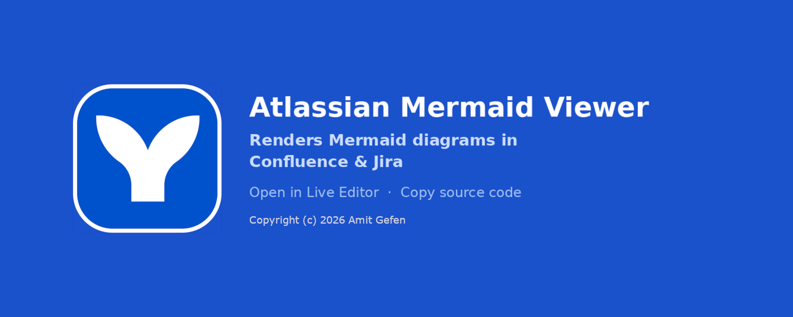

# Atlassian Mermaid Viewer

A Cross-Browser (Chrome, Edge & Firefox) extension that automatically renders [Mermaid](https://mermaid.js.org/) diagrams in Confluence and Jira. Authors write plain Mermaid code in a code snippet block - readers see the rendered chart, with a hover toolbar to open in Mermaid Live or copy the code.

---

## Features

- Renders Mermaid diagrams inline, replacing the raw code snippet block
- Hand-drawn visual style (`look: 'handDrawn'`)
- Hover toolbar with two actions:
  - **Open in Mermaid Live** - opens a new tab with the diagram pre-loaded for editing, exporting, or sharing
  - **Copy code** - copies the raw Mermaid source to the clipboard with a checkmark confirmation
- Supports Confluence Cloud and Jira (both are React SPAs - handled via MutationObserver)
- Light and dark mode aware
- No external runtime requests - all assets are bundled locally

---

## Architecture

The extension has two JavaScript files with distinct responsibilities, separated by the browser's content script isolation boundary.

```
atlassian-mermaid-viewer/
├── manifest.json
├── mermaid-viewer.js     # content script - bridges icon into page context, injects page scripts
├── mermaid-page.js       # page-context script - injected by mermaid-viewer.js
├── vendors/
│   └── mermaid.min.js    # bundled Mermaid v11 - injected by mermaid-viewer.js
├── assets/
│   ├── icon.svg          # authored source icon - single source of truth for all icons
│   ├── promo_marquee_1400x560.png
│   └── promo_small_440x280.png
├── icons/                # generated by make-icons.ps1 - do not edit directly
│   ├── icon16.png
│   ├── icon32.png
│   ├── icon48.png
│   ├── icon128.png
│   └── icon128_padded.png
├── make-icons.ps1        # generates icons/ from assets/icon.svg
├── README.md
└── LICENSE
```

### Directory conventions

- `assets/` - authored source files packaged with the extension and accessible at runtime via `browser.runtime.getURL()`.
- `icons/` - generated build output produced by `make-icons.ps1` from `assets/icon.svg`.

### Why two scripts?

Chrome/Edge/Firefox content scripts run in an isolated JavaScript world - they share the 
page's DOM but not its `window` globals. Mermaid must be called as 
`window.mermaid`, which is only accessible from the page's own execution 
context.

Injecting code into the page context is normally done via inline `<script>` 
tags - but Confluence's Content Security Policy (CSP) explicitly blocks them. 
Only scripts served from extension origins are allowed (`chrome-extension://` on 
Chromium-based browsers, `moz-extension://` on Firefox).

To satisfy both constraints, `mermaid-viewer.js` injects `mermaid.min.js` and 
`mermaid-page.js` as `<script src="...">` tags using URLs obtained via 
`browser.runtime.getURL()`. Both scripts are declared as `web_accessible_resources` 
in `manifest.json`, making them available at their browser-assigned extension URLs. 
Both then execute in the page context where `mermaid` is a real global.

The same isolation applies to `browser.runtime` - available in the content script 
world but not in the page context. `mermaid-viewer.js` acts as the bridge: it 
resolves and pre-processes any assets that require `browser.runtime`, then passes 
the results to `mermaid-page.js` via the shared DOM.

Inline `<style>` tags are not restricted by Confluence's CSP, so 
`mermaid-page.js` injects its styles directly.

---

## How it works

1. `mermaid-viewer.js` runs at `document_idle` as a content script
2. Injects `mermaid.min.js` and `mermaid-page.js` into the page context
3. `mermaid-page.js` scans the DOM for `<code class="language-...">` elements whose text starts with a known Mermaid keyword
4. Each matching block is replaced with a rendered SVG diagram panel
5. A `MutationObserver` (debounced 300ms) watches for new content added by the SPA router and re-runs the scan

### Open Mermaid Live icon - injection detail

1. `mermaid-viewer.js` fetches `assets/icon.svg` and tints it to Mermaid Live brand pink (`#FF3670`)
2. The result is written to `document.documentElement.dataset.mermaidIconSvg`
3. `mermaid-page.js` reads it back synchronously - no async dependency, no race condition

---

## Diagram detection

Mermaid diagrams are detected by checking whether the trimmed code block text starts with a known diagram-type keyword:

```javascript
const MERMAID_STARTERS = [
    'graph ', 'flowchart ', 'sequenceDiagram', 'classDiagram',
    'erDiagram', 'gantt', 'pie ', 'stateDiagram', 'gitGraph'
];
```

To support a new diagram type, add its keyword here.

---

## Mermaid v11 quirks

Several Confluence CSS rules interfere with Mermaid v11's output. All fixes live in `mermaid-page.js`.

### SVG sizing

v11 sets `width="100%"`, a `height` attribute, and an inline `style="max-width: Xpx"` (the diagram's natural width). If left as-is, the inline style overrides the CSS `max-width: 100%` rule, causing large diagrams to overflow.

Fix: remove the `height` attribute, promote the inline `max-width` value to a `width` attribute, then remove the inline style. The CSS rule then caps it only when it genuinely overflows - small diagrams render at their natural size.

### Phantom text nodes

After `mermaid.render()`, leftover whitespace text nodes in the container create a spurious gap at the bottom. These are filtered out by type (`Node.TEXT_NODE`) and removed; they have no effect on SVG rendering.

### Label rendering (`<foreignObject>`)

v11 renders node and edge labels inside `<foreignObject>` divs, making them subject to Confluence's full CSS cascade.

Two issues arise:

- **Styles**: Confluence's element rules override Mermaid's label styles in unpredictable ways. Fixed with `foreignObject * { all: revert }`, which strips all inherited Confluence styles and reverts to user-agent defaults across all nesting levels (node labels are direct children `foreignObject > div`; edge labels like Yes/No nest deeper `foreignObject > div > p`).
- **Centering**: v11 sets inline `display: flex; align-items: center` on the `foreignObject` div to vertically center node labels. Confluence's div rules collapse this to `display: block`, pushing text to the top-left. Fixed by re-asserting `display: flex`, `align-items: center`, `justify-content: center`, and `height: 100%` explicitly.

---

## Key decisions

| Decision | Rationale |
|---|---|
| `look: 'handDrawn'` | Rough.js aesthetic - intentional, distinguishes diagrams from page content |
| `securityLevel: 'strict'` | `'loose'` allows raw HTML in node labels (e.g. `["line one<br/>line two"]`) which increases XSS risk when diagram content is not fully sanitized |
| Each "Open in Mermaid Live" click opens a new tab | Prevents overwriting edits the user may have made in a previously opened tab |
| 300ms MutationObserver debounce | Confluence/Jira render page content incrementally after SPA navigation. Scanning too early means `isMermaid()` sees empty code blocks |
| MutationObserver self-trigger filter | Our own `innerHTML` writes fire the observer. Filtered by checking `m.target.closest('[data-mermaid-processed]')` to avoid redundant re-scans |
| `data-mermaid-processed` guard | Prevents double-processing when the MutationObserver fires multiple times on the same content |
| Replace `.code-block` wrapper | Confluence wraps `<code>` in a `.code-block` div with its own gray background and padding. Replacing the wrapper (falling back to `<pre>` or the `<code>` element itself) prevents the original styling from bleeding through beneath the rendered panel |
| Toolbar opacity 0.5 on hover | Subtle presence - the toolbar is discoverable without competing with the diagram itself |
| "Rendering…" placeholder | Shown while `mermaid.render()` is in flight; replaced by the SVG (or an error) on completion |
| Mermaid Live icon tinted at startup | `assets/icon.svg` is fetched once by the content script, the background rect is replaced with `#FF3670` via a regex targeting the `<rect>` element (not the color value, so it is robust against future icon color changes), and the result is stored in `dataset` for `mermaid-page.js` to consume synchronously. No external fetch, no duplicate asset, no CSS filter hacks |

---

## Development setup

1. Clone the repo

### Chrome / Edge
2. Go to `chrome://extensions` (or `edge://extensions`)
3. Enable **Developer mode**
4. Click **Load unpacked** and select the repo folder

### Firefox
5. Go to `about:debugging#/runtime/this-firefox`
6. Click **Load Temporary Add-on…**
7. Select the `manifest.json` file from the repo folder

8. Open any Confluence or Jira page with a Mermaid code block

## Applying code changes

1. Reload the extension:
   - Chrome: `chrome://extensions` → click **↺ Reload**
   - Edge: `edge://extensions` → click **↺ Reload**
   - Firefox: `about:debugging#/runtime/this-firefox` → click **Reload**

2. Reload the Atlassian page (Confluence or Jira)

### Updating mermaid.min.js

Download and strip the BOM in one step:

```powershell
curl.exe -L "https://cdn.jsdelivr.net/npm/mermaid@11/dist/mermaid.min.js" -o "mermaid.min.js"
$content = [System.IO.File]::ReadAllText("mermaid.min.js", [System.Text.Encoding]::UTF8)
$utf8NoBom = New-Object System.Text.UTF8Encoding $false
[System.IO.File]::WriteAllText("mermaid.min.js", $content, $utf8NoBom)
Write-Host "Done. Size: $((Get-Item mermaid.min.js).Length) bytes"
```

Expected output: `Done. Size: 3312967 bytes`. Use `curl.exe`, not `Invoke-WebRequest`.

## Using with AI assistants

If you use Claude to write or edit Mermaid diagrams in Confluence or Jira, instruct it once:

> "Remember: When writing or editing Mermaid diagrams in Atlassian tools (Jira or Confluence), always place the Mermaid code in a code snippet block with no language specified."

That covers the trigger (Mermaid code + Atlassian context) and the behavior (plain code block, no language tag) without ambiguity.